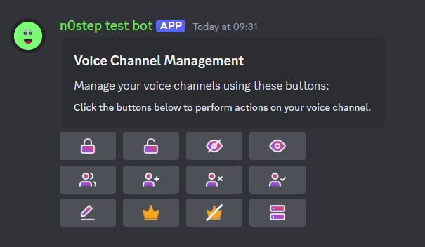
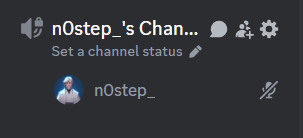
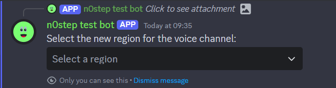
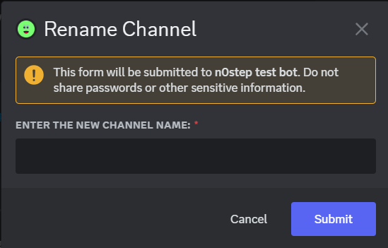
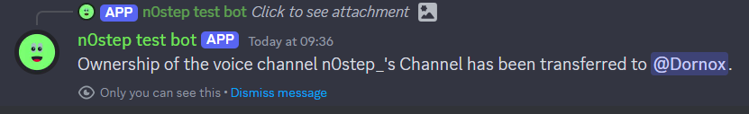

# Discord Voice Channel Management Bot

## Table of Contents

1. [Introduction](#introduction)
2. [Screenshots](#screenshots)
3. [Data Structure](#data-structure)
4. [How the Menu Command Works](#how-the-menu-command-works)
5. [Handling Interactions](#handling-interactions)
6. [Additional Features](#additional-features)

## Introduction

The Discord Voice Channel Management Bot provides an enhanced interface for managing voice channels within a Discord server. This bot allows users to perform various actions on voice channels using both command inputs and interactive buttons. Features include locking/unlocking channels, setting user limits, inviting users, and more.

## Screenshots

|  |  |  |
|:------------------------------------------:|:--------------------------------------------:|:--------------------------------------------:|
|  |  |  |
|                                            |                                            |                                            |

## Data Structure

The `data.json` file is organized into distinct sections, each serving a specific purpose in the management of Discord channels and global metrics. The primary sections include `guilds`, `totalChannelsCreated`, `activeChannels`, and `globalActiveChannelCount`.

### 1. `guilds`

The `guilds` section maintains a detailed record of each guild's setup and active channels. Each entry is indexed by the guild's unique identifier (Guild ID). The data structure for each guild is as follows:

- **Key**: `guildId` (String) - The unique identifier for the guild.
- **Value**: An object containing:
  - **`jtcCategoryId`** (String): The unique identifier of the category under which JTC channels are organized.
  - **`jtcChannelId`** (String): The unique identifier of the primary voice channel used for channel creation (Join to Create).
  - **`controlPanelChannelId`** (String): The unique identifier of the text channel that hosts the control panel interface.
  - **`channels`** (Object): A mapping of voice channel IDs to their respective data. This includes:
    - **Key**: `channelId` (String) - The unique identifier for each voice channel created by the bot.
    - **Value**: An object with:
      - **`ownerId`** (String): The unique identifier of the member who owns the channel.
  - **`activeChannelCount`** (Integer): A count of the currently active voice channels within the guild.

**Example**:
```json
"guilds": {
  "877062059966206002": {
    "jtcCategoryId": "1279863632037154947",
    "jtcChannelId": "1279863633584591094",
    "controlPanelChannelId": "1279863635480543254",
    "channels": {
      "1279863633584591094": {
        "ownerId": "123456789012345678"
      }
    },
    "activeChannelCount": 1
  }
}
```

### 2. `totalChannelsCreated`

This global counter tracks the total number of voice channels created by the bot across all guilds. It provides insight into the overall activity of channel creation.

**Example**:
```json
"totalChannelsCreated": 2
```

### 3. `activeChannels`

The `activeChannels` section records the active voice channels across all guilds. This section helps in managing the state of channels and is crucial for operations like setup deletion.

- **Key**: `guildId` (String) - The unique identifier for the guild.
- **Value**: An object where:
  - **Key**: `channelId` (String) - The unique identifier for each active voice channel.
  - **Value**: An object with:
    - **`ownerId`** (String): The unique identifier of the member who owns the channel.

**Example**:
```json
"activeChannels": {
  "877062059966206002": {
    "1279863633584591094": {
      "ownerId": "123456789012345678"
    }
  }
}
```

### 4. `globalActiveChannelCount`

This global counter keeps track of the total number of active voice channels across all guilds. It aggregates the active channel count from the `activeChannels` section, providing a holistic view of channel activity.

**Example**:
```json
"globalActiveChannelCount": 1
```

## How the Menu Command Works

The `/menu` command provides a dynamic and interactive way to manage voice channels through a series of buttons embedded in a message. This command:

1. **Receives Input**: Users invoke the `/menu` command and specify a target text channel where the management panel should be sent. The command is designed to handle this input and ensure the specified channel is a valid text channel.

2. **Generates Buttons**: The command creates a series of buttons for various actions:
   - **Row 1**: Contains buttons for locking, unlocking, hiding, and unhiding the voice channel.
   - **Row 2**: Contains buttons for setting user limits, inviting users, banning users, and permitting users.
   - **Row 3**: Contains buttons for renaming the channel, claiming ownership, transferring ownership, and changing the channel region.

3. **Sends the Embed**: An `EmbedBuilder` is used to format and style the message that contains the buttons. This message is then sent to the specified text channel, providing users with a user-friendly interface to manage their voice channels.

4. **Interaction Handling**: Once the embed with buttons is sent, users can interact with these buttons to perform actions on their voice channels. Each button triggers specific logic to modify the voice channel based on the button pressed.

## Handling Interactions

The bot processes different types of interactions using event handlers:

1. **Button Interactions**: The `handleButtonInteraction` function handles actions like locking, unlocking, hiding, unhiding, setting limits, inviting, banning, permitting, renaming, claiming ownership, and transferring ownership. Each interaction is processed based on the user's permissions and the state of the voice channel.

2. **Modal Submissions**: The `handleModalSubmit` function processes user input from modals for actions like setting user limits, renaming channels, banning or permitting users, claiming ownership, and transferring ownership. It updates the `data.json` file accordingly.

3. **Select Menus**: The bot also handles select menu interactions for changing the voice channel's region, ensuring that the region is updated based on the user's selection.

4. **Voice State Updates**: The bot tracks voice state changes to create and manage voice channels dynamically. It handles scenarios where channels are deleted and ensures the `data.json` file remains synchronized with the actual state of the channels.

## Additional Features

- **Dynamic Data Handling**: The bot maintains and updates channel data dynamically to reflect changes in voice channel ownership and settings.
- **Interactive UI**: Provides users with an easy-to-use interface for managing voice channels without the need to repeatedly invoke commands.
- **Error Handling**: Includes error handling mechanisms to manage issues such as invalid user IDs, permissions errors, and interactions with non-existent channels.

> [!WARNING]
> This is a multi-guild-bot. If you wish to use single-guild, move to this [branch](https://github.com/krushna06/JTC-Discord/tree/Single-Guild).